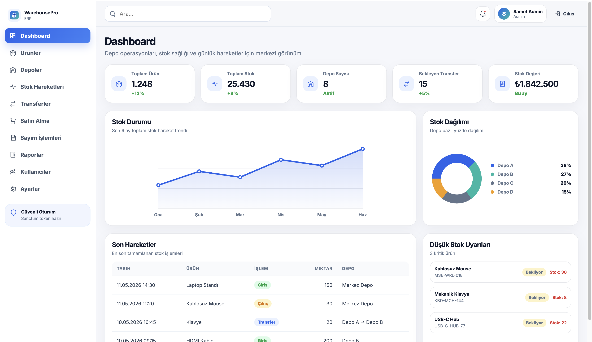
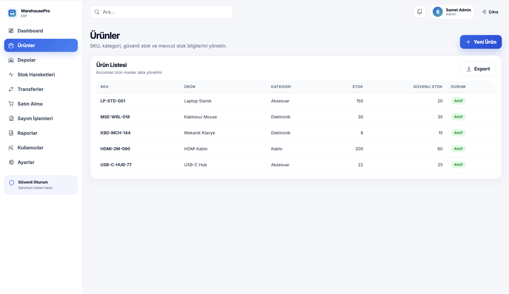
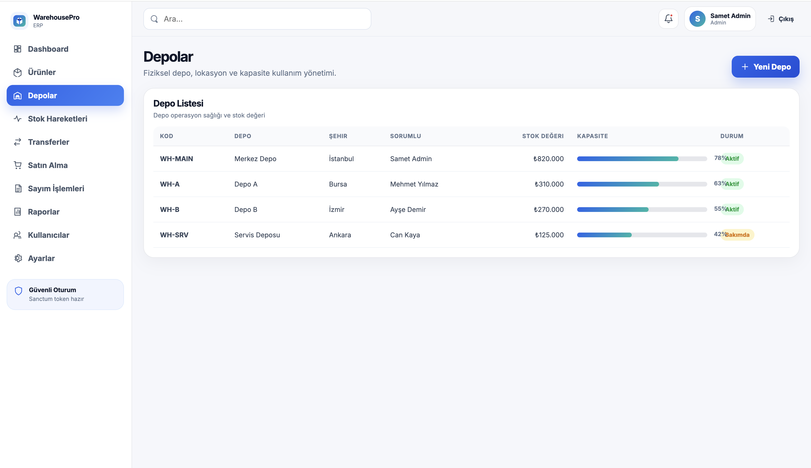
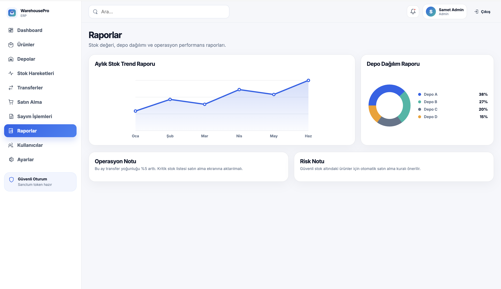
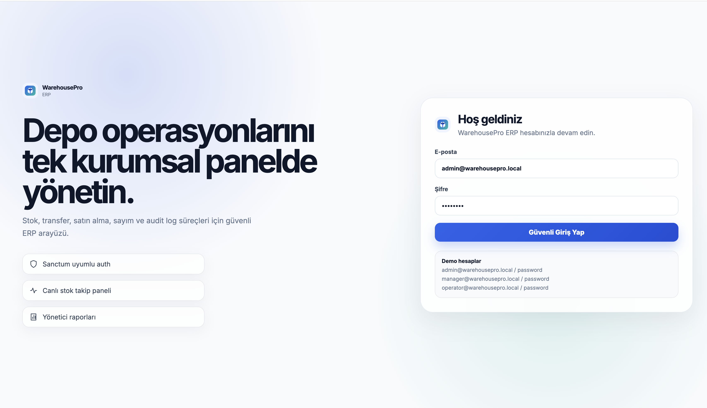

# WarehousePro ERP Kit

**WarehousePro ERP Kit** is a security-focused Warehouse Management ERP starter kit built with **Laravel (PHP)** and **React + TypeScript**.

It is designed as a GitHub-ready professional project: developers can clone it, configure environment variables, run migrations, and use it as a clean base for warehouse, stock, supplier, purchase, transfer, and inventory count workflows.

> Turkish summary: Laravel API + React panel ile geliştirilmiş profesyonel depo yönetimi ERP starter kitidir. Stok hareketleri, depo transferleri, ürünler, tedarikçiler, satın alma siparişleri, envanter sayımı, yetkilendirme ve audit log mantığı içerir.

---

## Tech Stack

### Backend

- PHP 8.2+
- Laravel 11/12 compatible structure
- Laravel Sanctum token authentication
- MySQL / MariaDB
- Form Request validation
- Policies and role-based authorization
- DB transactions for stock operations
- Audit logs for critical changes
- Rate limiting on API routes

### Frontend

- React 18
- TypeScript
- Vite
- React Router
- Axios
- Clean component/page structure
- Protected routes
- API service layer

---

## Main Modules

- Dashboard KPIs
- Product / SKU management
- Warehouse management
- Stock items per warehouse
- Stock in / stock out / adjustment
- Warehouse-to-warehouse transfers
- Supplier management
- Purchase orders
- Inventory counts
- Audit logs
- User roles: `admin`, `manager`, `operator`

---

## Architecture

```text
React Admin Panel
        |
        | HTTPS / REST API
        v
Laravel API Backend
        |
        | Eloquent ORM + Transactions
        v
MySQL Database
```

The React app never connects directly to the database. It communicates only with the Laravel API. Laravel validates every request, authorizes actions, performs stock operations inside database transactions, and writes audit logs for traceability.

---

## Screen Preview

<p align="center">
  
</p>

<p align="center">
  A modern warehouse ERP interface with secure authentication, operational dashboards, stock workflows, and management views.
</p>

<table>
  <tr>
    <td width="50%">
      
    </td>
    <td width="50%">
      
    </td>
  </tr>
  <tr>
    <td align="center">Operational overview and day-to-day stock workflow screens</td>
    <td align="center">Transfer, inventory, and product management flows</td>
  </tr>
  <tr>
    <td width="50%">
      
    </td>
    <td width="50%">
      
    </td>
  </tr>
  <tr>
    <td align="center">Warehouse operations, approvals, and control panels</td>
    <td align="center">Reporting-ready admin views for teams and managers</td>
  </tr>
</table>

---

## Repository Structure

```text
warehouse-erp-laravel-react-kit/
├── backend/        Laravel API source
├── frontend/       React + TypeScript source
├── docs/           Architecture, security, API and interview notes
├── postman/        API collection
├── scripts/        Local helper scripts
├── README.md
└── LICENSE
```

---

## Quick Start

### 1. Backend

```bash
cd backend
cp .env.example .env
composer install
php artisan key:generate
php artisan migrate --seed
php artisan serve --port=8000
```

The seeded users are documented in `docs/security.md`. Change sample passwords before using the project outside local development.

### 2. Frontend

```bash
cd frontend
cp .env.example .env
npm install
npm run dev
```

Default frontend API URL:

```env
VITE_API_BASE_URL=http://127.0.0.1:8000/api
```

---

## Security Highlights

This kit is intentionally written with security practices visible in the code:

- No database credentials in frontend
- `.env.example` only; real `.env` is ignored
- Laravel Sanctum token authentication
- Passwords hashed with Laravel's `Hash` facade
- Request validation through FormRequest classes
- Authorization through policies and role checks
- Stock operations wrapped in `DB::transaction()`
- Audit logging for stock, product, transfer and authentication events
- API rate limits on authentication and protected endpoints
- No raw SQL for user input
- Mass assignment protected through `$fillable`
- Soft deletes on business entities where appropriate

Read more in [`docs/security.md`](docs/security.md).

---

## Interview Pitch

> “I built WarehousePro ERP Kit as a reusable Laravel + React warehouse management starter kit. The backend uses Laravel Sanctum for authentication, FormRequest validation, policies for authorization, database transactions for stock operations, and audit logs for traceability. The React frontend is structured as a professional admin panel with protected routes and a clean API service layer. This is not just a CRUD app; it models real ERP warehouse workflows like stock movements, warehouse transfers, purchase orders, and inventory counts.”

Full interview explanation: [`docs/interview-explanation.md`](docs/interview-explanation.md)

---

## License

MIT License. See [`LICENSE`](LICENSE).
